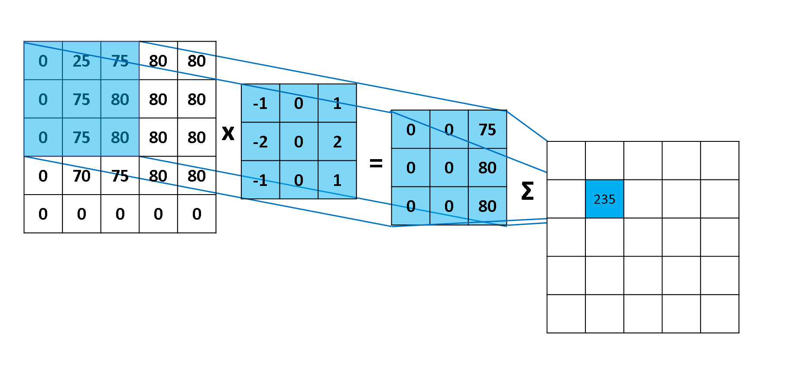
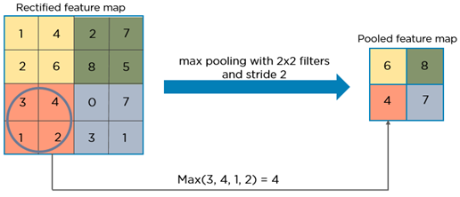
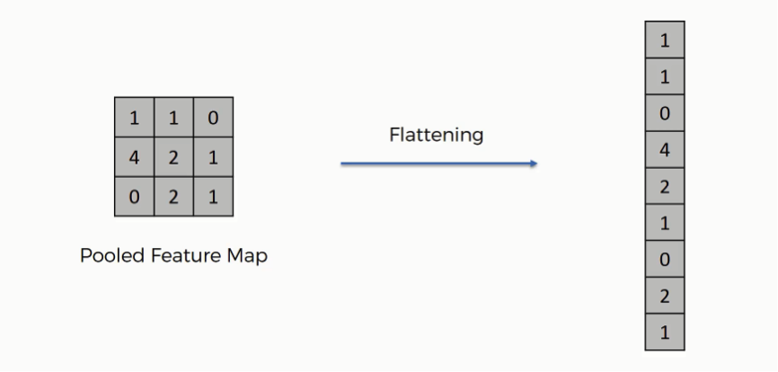

## Convolutional Neural Network (CNN)

Algorithm:
  * Convolution
    * In this stage, we have input image and feature detectors (aka kernel or filter). Convolution operation scans the input image from the lens of feature detector to create a feature map. In this process areas of the image that match feature detector pattern will be intensified. Since we use multiple feature detectors, in the end, we have multiple feature maps at the end of this step.
    * Convolution sometimes create linearity between features of the final feature map. To break this linearity and add more non-linearity, we use Rectifier (ReLU) activation function. The benefit of this step is clearer in mathematics. 
    * 
  * Max Pooling
    * This step is necessary to make CNN **spatial invariant**.
    * One of the added value of max pooling is reducing the size of an image. Since we only take the maximum value of a cell, the other non-important values will be discarded, and it saves a lot of computation.
    *  
  * Flattening
    * Flattening is converting the data into a 1-dimensional array for inputting it to the next layer. We flatten the output of the convolutional layers to create a single long feature vector. And it is connected to the final classification model, which is called a fully-connected layer. 
    *  
  * Full Connection
    * Unlike ANN, in CNN, the hidden layers are fully connected. 

Question: When we flatten, why don't we lose spatial information? The reason is the spatial structure of the original image is extracted in the first stage (convolution). Basically each kernel relates to certain spatial structure/property and if the original image has that structure, that would be captured by getting a high convolution value. So, the spatial information are within the values and not their orders and we are not going to lose any information by flattening the pooling layer. 

Question: What is the benefit of image augmentation? In order to get a good image classification, not only we should have a wide variety of images, we must have those images in different positions, rotations, ... . So, we either must have a lot of different images, or we can use a trick and create a different variants of existing images. In Keras, there are tools that can perform this image augmentation to create a good training dataset. Another benefit of image augmentation is to avoid overfitting. 
