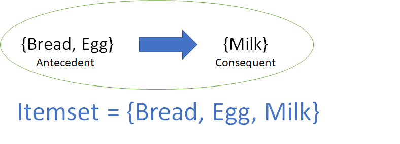
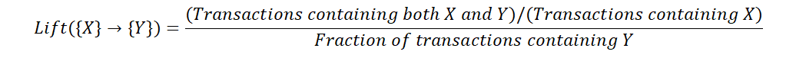

## Association Rule

Association Rules is one of the very important concepts of machine learning being used in market basket analysis. Rules consist of an antecedent and a consequent, both of which are a list of items. Note that implication here is **co-occurrence** and not causality. For a given rule, itemset is the list of all the items in the antecedent and the consequent.

Various metrics are in place to help us understand the strength of association between these two. Let us go through them all.

**Support:**\
This measure gives an idea of how frequent an itemset is in all the transactions. Consider itemset1 = {bread} and itemset2 = {shampoo}. There will be far more transactions containing bread than those containing shampoo. So as you rightly guessed, itemset1 will generally have a higher support than itemset2. Now consider itemset1 = {bread, butter} and itemset2 = {bread, shampoo}. Many transactions will have both bread and butter on the cart but bread and shampoo? Not so much. So in this case, itemset1 will generally have a higher support than itemset2. Mathematically, support is the fraction of the total number of transactions in which the itemset occurs.

Value of support helps us identify the rules worth considering for further analysis. For example, one might want to consider only the itemsets which occur at least 50 times out of a total of 10,000 transactions i.e. support = 0.005. If an itemset happens to have a very low support, we do not have enough information on the relationship between its items and hence no conclusions can be drawn from such a rule.

**Confidence:**\
This measure defines the likeliness of occurrence of consequent on the cart given that the cart already has the antecedents. That is to answer the question — of all the transactions containing say, {Captain Crunch}, how many also had {Milk} on them? We can say by common knowledge that {Captain Crunch} → {Milk} should be a high confidence rule. Technically, confidence is the conditional probability of occurrence of consequent given the antecedent.

**Lift:**\
Lift controls for the support (frequency) of consequent while calculating the conditional probability of occurrence of {Y} given {X}. Lift is a very literal term given to this measure. Think of it as the *lift* that {X} provides to our confidence for having {Y} on the cart. To rephrase, lift is the rise in probability of having {Y} on the cart with the knowledge of {X} being present over the probability of having {Y} on the cart without any knowledge about presence of {X}. Mathematically,

A value of lift greater than 1 vouches for high association between {Y} and {X}. More the value of lift, greater are the chances of preference to buy {Y} if the customer has already bought {X}. Lift is the measure that will help store managers to decide product placements on aisle.

Association Rule Mining:
  * Apriori Algorithm
  * Eclat Algorithm

What is the difference b/w **Association Rule** and **Collaborative Filtering**?
  * Rules do not tie back a users’ different transactions __over time__ to identify relationships. List of items with unique transaction IDs (**from all users**) are studied as one group. **This is helpful in placement of products on aisles**. 
  * On the other hand, collaborative filtering ties back all transactions corresponding to a user ID to identify similarity between **users’ preferences**. **This is helpful in recommending items on e-commerce websites, recommending songs on spotify, etc**.
  
Source: 
