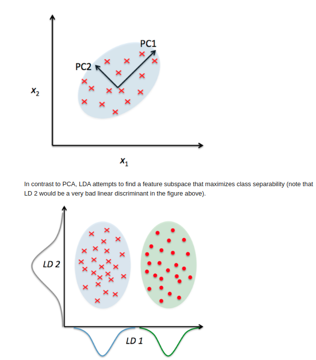

## Linear Discriminant Analysis (LDA)

LDA, similar to PCA, is a linear transformation method commonly used in dimensionality reduction tasks. However unlike the latter which is an unsupervised learning algorithm, LDA falls into the class of supervised learning methods. As such the goal of LDA is that with available information about class labels, seeks to maximise the separation between the different classes by computing the component axes (linear discriminants ).

The goal of LDA is to project a feature space ( n-D sample) onto a small subspace k (k < n) while maintaining the class-dicriminatory information. In other words, from the n independent variables of the dataset, LDA extracts p <= n new independent variables that separate the most the classes of the dependent variable. 

Below is the visual difference b/w LDA and PCA. As you see in the LDA case, the projection that captures the maximum variation is not a good axis. 

